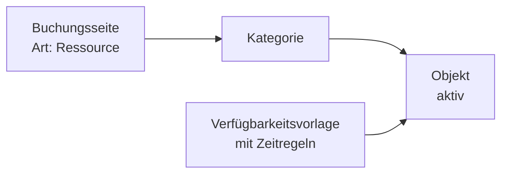
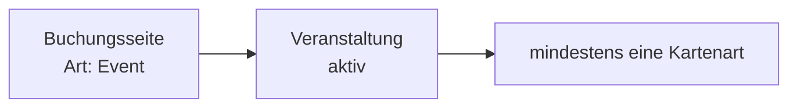

Die **Buchungsseite** ist die Internetseite, auf der Ihre Kundinnen und Kunden selbst buchen. Sie brauchen dafür keine eigene Webseite – Rzvation stellt die Seite für Sie bereit. Den Link können Sie überall teilen: auf Ihrer Webseite, per E-Mail, im Newsletter oder als QR-Code auf einem Aushang.

<Info>
  **Wo finden Sie das?** **Organisation → Buchungsseiten**. Dort sehen Sie alle Buchungsseiten mit ihrem Link. Wie Sie eine Buchungsseite anlegen, steht unter [Buchungsseiten erstellen und bearbeiten](/buchungsseiten-erstellen-bearbeiten).
</Info>

## Die Adresse einer Buchungsseite

Jede Buchungsseite hat eine eigene Adresse. Sie ist so aufgebaut:

```text
https://www.rzvation.com/<kennung-ihrer-organisation>/<kennung-der-buchungsseite>
```

Zum Beispiel: `https://www.rzvation.com/tc-musterstadt/tennisplaetze`

- Den ersten Teil legen Sie unter **Organisation → Einstellungen → Kennung (URL)** fest. Siehe [Einstellungen](/einstellungen#kennung-url).
- Den zweiten Teil (den **Slug**) legen Sie bei der Buchungsseite selbst fest.

## Zwei Arten von Buchungsseiten

Beim Anlegen wählen Sie die **Art der Buchungsseite**. Das lässt sich später nicht mehr ändern.

<CardGroup cols={2}>
  <Card title="Ressource" icon="calendar">
    Für **Zeitslot-Buchungen**: Räume, Plätze, Geräte, Fahrzeuge, Kurse, Sprechzeiten.

    Besucher sehen einen Kalender, wählen einen Tag und buchen eine freie Uhrzeit.
  </Card>
  <Card title="Event" icon="ticket">
    Für **Eintrittskarten**: Feste, Konzerte, Aufführungen.

    Besucher wählen eine Veranstaltung, die Anzahl der Karten je Kartenart und optionale Zusatzleistungen.
  </Card>
</CardGroup>

## So sieht die Buchung für Ihre Besucher aus

<Tabs>
  <Tab title="Ressource">
    <Steps>
      <Step title="Tag wählen">
        Im Kalender sind freie Tage als **Verfügbar** markiert, geschlossene Tage als **Geschlossen**.
      </Step>
      <Step title="Objekt und Uhrzeit wählen">
        Die Besucherin sieht alle Objekte mit ihren freien Startzeiten. Über die Reiter oben kann sie nach Kategorie filtern. Sie wählt **Beginn** und **Ende**; der Preis wird sofort angezeigt. Dann klickt sie auf **Reservieren**.
      </Step>
      <Step title="Angaben machen">
        Im Fenster **Ihre Angaben** trägt sie Name, E-Mail und die von Ihnen geforderten Pflichtfelder ein. Gibt es Zusatzoptionen, kann sie diese unter **Extras & Zusatzoptionen** dazubuchen. Falls mehrere Zahlungsarten möglich sind, wählt sie eine aus.
      </Step>
      <Step title="Absenden">
        Je nach Einstellung heißt die Schaltfläche **Reservierung bestätigen**, **Anfrage senden** (bei Freigabe) oder **Weiter zur Zahlung** (bei Onlinezahlung).
      </Step>
    </Steps>

    Danach sieht sie **Reservierung bestätigt** oder **Reservierungsanfrage übermittelt** mit einer **Referenz** (Buchungsnummer) und erhält eine E-Mail.

    <Note>
      Während jemand eine Buchung ausfüllt, wird der gewählte Zeitraum für ca. **10 Minuten** vorgemerkt. So kann niemand anderes denselben Termin gleichzeitig buchen.
    </Note>
  </Tab>
  <Tab title="Event">
    <Steps>
      <Step title="Veranstaltung wählen">
        Gibt es mehrere Veranstaltungen, wählt die Besucherin eine aus (**Veranstaltung auswählen**).
      </Step>
      <Step title="Karten wählen">
        Sie wählt die Anzahl je Kartenart. Bei knappen Kontingenten erscheint „noch X verfügbar“, bei ausgebuchten Karten **Ausverkauft**.
      </Step>
      <Step title="Zusatzoptionen (optional)">
        Unter **Extras & Zusatzoptionen** kann sie z. B. einen Parkplatz dazubuchen.
      </Step>
      <Step title="Angaben und Bezahlung">
        Sie trägt ihre Daten ein, wählt ggf. die Zahlungsart und schließt mit **Buchung bestätigen** ab.
      </Step>
    </Steps>

    Nach der Buchung kann sie mit **Alle Tickets ansehen & drucken** ihre Karten öffnen. Die Karten kommen außerdem per E-Mail.
  </Tab>
</Tabs>

## Nur für Mitglieder

Sie können eine Buchungsseite so einstellen, dass **nur Ihre Mitglieder** buchen dürfen. Dann fragt die Seite zuerst: „Sind Sie Mitglied bei …?“. Die Person gibt ihre **E-Mail oder Handynummer** ein. Rzvation prüft, ob sie in Ihrer [Mitgliederliste](/mitglieder) steht und freigeschaltet ist.

Wer noch nicht in der Liste steht, kann über **Freischaltung beantragen** einen Antrag senden. Den Antrag bestätigen Sie in der Verwaltung. Siehe [Mitglieder freischalten](/mitglieder#mitglieder-freischalten).

## Wie hängt alles zusammen?

Eine Buchungsseite allein ist noch nicht buchbar. Damit Termine erscheinen, braucht es:



Bei einer Event-Buchungsseite:



<Tip>
  Prüfen Sie nach Änderungen immer die Buchungsseite aus Sicht Ihrer Besucher. Klicken Sie dazu unter **Organisation → Buchungsseiten** auf den Link in der Spalte **URL**.
</Tip>

## Wie viele Buchungsseiten brauche ich?

Meist reicht **eine**. Mehrere Buchungsseiten sind sinnvoll, wenn Sie zum Beispiel mehrere Standorte haben, unterschiedliche Zielgruppen ansprechen (öffentlich und nur für Mitglieder) oder mehrere Veranstaltungen getrennt anbieten möchten.

Wie viele Ressourcen-Buchungsseiten Sie anlegen können, hängt von Ihrem [Tarif](/abonnement) ab. Event-Buchungsseiten sind nicht begrenzt.
