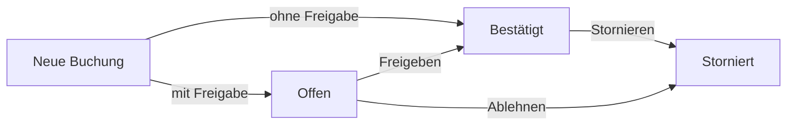

Eine **Reservierung** (auch: **Buchung**) entsteht, wenn jemand ein Objekt zu einer bestimmten Zeit bucht oder Eintrittskarten für eine Veranstaltung kauft. Sie kann über die öffentliche [Buchungsseite](/buchungsseiten) oder durch Sie selbst über die [Schnellbuchung](/uebersicht#schnellbuchung) entstehen.

<Info>
  **Wo finden Sie das?** In der linken Leiste unter **Reservierungen** (Kalender-Symbol). Wie Sie Buchungen bearbeiten, steht unter [Reservierungen verwalten](/reservierungen-verwalten).
</Info>

## Die Buchungsreferenz

Jede Buchung hat eine eindeutige **Buchungsreferenz** (Buchungsnummer). Die Kundin sieht sie nach dem Buchen und in ihrer Bestätigungsmail. Wenn jemand anruft, suchen Sie am schnellsten nach dieser Referenz.

Bucht jemand mehrere Eintrittskarten oder Zusatzoptionen auf einmal, haben alle Positionen dieselbe Buchungsreferenz.

## Buchungsstatus

| Status | Bedeutung |
|---|---|
| **Offen** / **Wartet auf Freigabe** | Die Buchung ist eingegangen, muss aber noch von Ihnen freigegeben werden. Nur bei Kategorien mit **Freigabe erforderlich**. |
| **Bestätigt** | Die Buchung gilt. Der Termin ist belegt. |
| **Storniert** / **Abgelehnt** | Die Buchung wurde von Ihnen abgelehnt oder storniert. Der Termin ist wieder frei. |
| **Abgeschlossen** | Die Buchung ist erledigt. |

## Zahlungsarten

Welche Zahlungsarten angeboten werden, legen Sie pro [Buchungsseite](/buchungsseiten-erstellen-bearbeiten#zahlungsarten) fest.

| Zahlungsart | Bedeutung |
|---|---|
| **Vor Ort** | Die Kundin bezahlt bar oder vor Ort. Sie markieren die Zahlung später als bezahlt. |
| **Rechnung** | Sie stellen außerhalb von Rzvation eine Rechnung. Rzvation hilft Ihnen, den Überblick zu behalten. |
| **Onlinezahlung** | Die Kundin bezahlt direkt beim Buchen, z. B. per Karte. Voraussetzung: ein verbundenes [Stripe-Konto](/zahlungen). |
| **Kostenlos** | Die Buchung kostet nichts. |

## Zahlungsstatus

| Zahlungsstatus | Bedeutung |
|---|---|
| **Offen** / **Nicht bezahlt** | Es ist noch kein Geld eingegangen. |
| **Ausstehend** | Die Zahlung läuft oder ist vorgemerkt – zum Beispiel eine Onlinezahlung, die erst nach Ihrer Freigabe abgebucht wird. |
| **Bezahlt** | Das Geld ist eingegangen. |
| **Fehlgeschlagen** | Die Onlinezahlung hat nicht funktioniert. |
| **Erstattet** / **Teilweise erstattet** | Das Geld wurde ganz oder teilweise zurückgezahlt. |
| **Beanstandet** / **Streitfall** | Die Kundin hat die Zahlung bei ihrer Bank angefochten. |

<Note>
  „Offen“ kommt zweimal vor: Beim **Buchungsstatus** heißt es „wartet auf Freigabe“, beim **Zahlungsstatus** heißt es „noch nicht bezahlt“.
</Note>

## Welche E-Mails werden verschickt?

| Wann? | Wer bekommt die E-Mail? |
|---|---|
| Eine Buchung ist eingegangen | Die buchende Person (Bestätigung bzw. Eingangsbestätigung, ggf. mit Tickets) |
| Eine Buchung wartet auf Freigabe | Ihre Organisation – an die **E-Mail für Benachrichtigungen** aus [Kontakt](/kontakt) |
| Sie geben eine Buchung frei, lehnen sie ab oder stornieren sie | Die buchende Person |
| Sie ändern eine Buchung | Die buchende Person – nur wenn Sie das nach dem Speichern bestätigen |
| Sie markieren eine Buchung als bezahlt | Die buchende Person – eine Zahlungsbestätigung, nur wenn Sie das bestätigen |
| Jemand beantragt eine Mitgliedschaft | Ihre Organisation – an die **E-Mail für Benachrichtigungen** |
| Sie schalten ein Mitglied frei | Das Mitglied |

<Tip>
  Prüfen Sie unter [Kontakt](/kontakt), ob die **E-Mail für Benachrichtigungen** stimmt. Sonst verpassen Sie Buchungen, die auf Ihre Freigabe warten.
</Tip>
