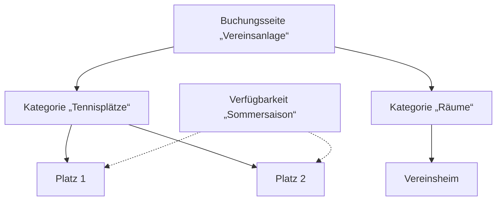

**Objekte** sind alles, was man bei Ihnen buchen kann: ein Tennisplatz, ein Besprechungsraum, ein Beamer, ein Fahrzeug oder eine Sprechstunde. In manchen Texten heißen sie auch **Ressourcen** – gemeint ist dasselbe.

<Info>
  **Wo finden Sie das?** In der linken Leiste unter **Objekte**. Die Seite hat die Reiter **Objekte**, **Kategorien** und **Verfügbarkeiten**.
</Info>

## Drei Bausteine

Damit ein Objekt auf Ihrer Buchungsseite erscheint, arbeiten drei Bausteine zusammen:

<CardGroup cols={3}>
  <Card title="1. Verfügbarkeit" icon="calendar-check" href="/verfuegbarkeit">
    **Wann** kann gebucht werden? Zum Beispiel Mo–Fr 8–20 Uhr, außer an Feiertagen.
  </Card>
  <Card title="2. Kategorie" icon="layer-group" href="/kategorien">
    **Welche Art** von Angebot? Zum Beispiel „Tennisplätze“. Legt gemeinsame Regeln und Preise fest.
  </Card>
  <Card title="3. Objekt" icon="cube" href="/objekt-anlegen-bearbeiten">
    **Was genau** wird gebucht? Zum Beispiel „Platz 1“, „Platz 2“.
  </Card>
</CardGroup>

Die Kategorie gehört zu einer [Buchungsseite](/buchungsseiten) der Art **Ressource**. Das Objekt gehört zu einer Kategorie.

## Voreinstellungen: Kategorie → Objekt

Die Einstellungen der Kategorie (Zeiteinheit, Dauer, Preise, Zugang) sind **Voreinstellungen**. Wenn Sie ein neues Objekt anlegen, übernimmt es diese Werte. Sie können sie danach für jedes Objekt einzeln ändern.

**Beispiel:** Die Kategorie „Tennisplätze“ kostet 12 € pro Stunde. Platz 3 hat Flutlicht und kostet 15 € – das stellen Sie direkt bei Platz 3 ein.

## Die richtige Reihenfolge

<Steps>
  <Step title="Buchungsseite anlegen">
    Art **Ressource**. → [Anleitung](/buchungsseiten-erstellen-bearbeiten)
  </Step>
  <Step title="Verfügbarkeit anlegen">
    Vorlage mit Gültigkeit und Zeitregeln. → [Anleitung](/verfuegbarkeit)
  </Step>
  <Step title="Kategorie anlegen">
    Buchungsseite und Verfügbarkeitsvorlage zuordnen, Dauer und Preise festlegen. → [Anleitung](/kategorien)
  </Step>
  <Step title="Objekte anlegen">
    Kategorie wählen, Namen vergeben, auf **Aktiv** stellen. → [Anleitung](/objekt-anlegen-bearbeiten)
  </Step>
</Steps>

<Tip>
  Der [Einrichtungsassistent](/schnellstart) erledigt diese vier Schritte in einem Durchgang für Ihr erstes Objekt.
</Tip>

## Wichtige Begriffe

| Begriff | Bedeutung |
|---|---|
| **Zeiteinheit** | Worin gebucht wird: Minuten, Stunden oder Tage. |
| **Mindestdauer** | Die kürzeste mögliche Buchung – und zugleich der Takt der Startzeiten. |
| **Maximale Buchungsdauer** | Die längste mögliche Buchung am Stück. |
| **Dauer anpassbar** | Ob Besucher die Dauer selbst verlängern dürfen. |
| **Slots** | Wie viele Buchungen gleichzeitig für dasselbe Objekt möglich sind (z. B. 4 Plätze in einer Sauna). |
| **Freigabe erforderlich** | Buchungen müssen erst von Ihnen bestätigt werden. |
| **Nur für Mitglieder** | Nur freigeschaltete Mitglieder sehen und buchen das Objekt. |
| **Mitgliederpreis** | Ein günstigerer Preis für Mitglieder. |
| **Zusatzoptionen** | Extras, die zum Objekt dazugebucht werden können (z. B. Leihschläger). |

Alle Begriffe von A bis Z finden Sie im [Stichwortverzeichnis](/stichwortverzeichnis).

## Grenzen Ihres Tarifs

Wie viele Objekte Sie anlegen können, hängt von Ihrem [Tarif](/abonnement) ab (Free: 1 Objekt). Ist die Grenze erreicht, erscheint beim Anlegen ein Hinweis mit der Bitte um ein Upgrade.
